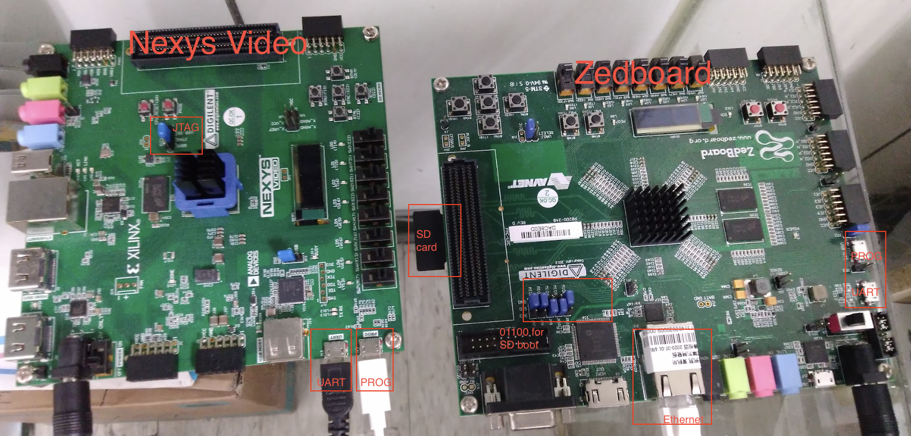
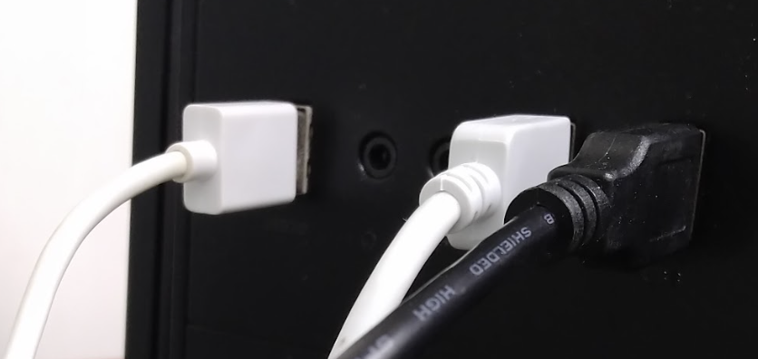
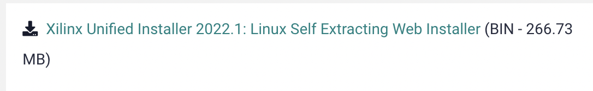
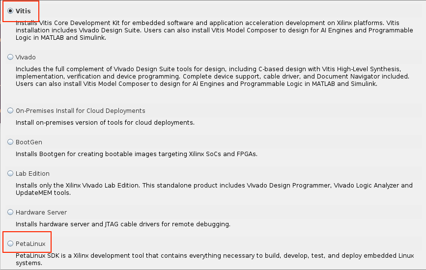
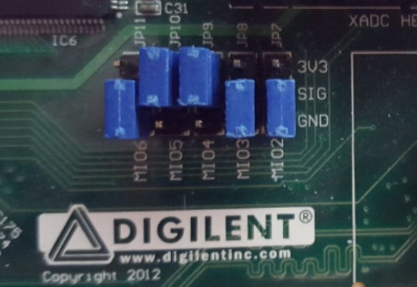
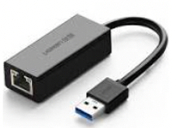
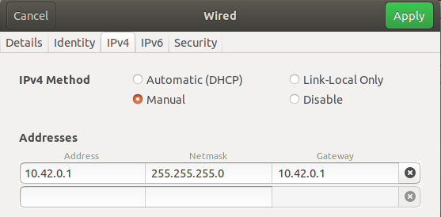
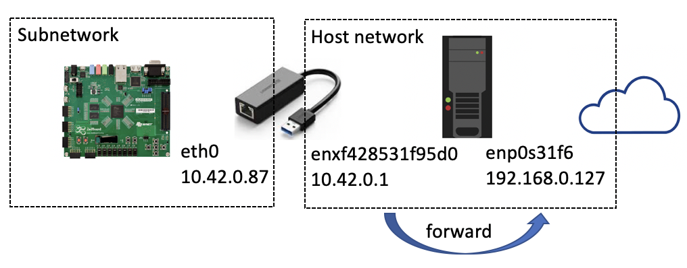
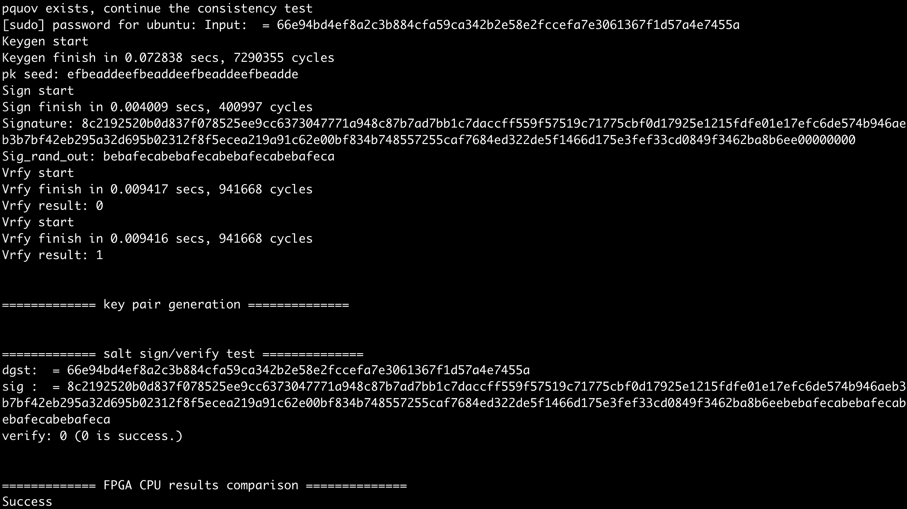
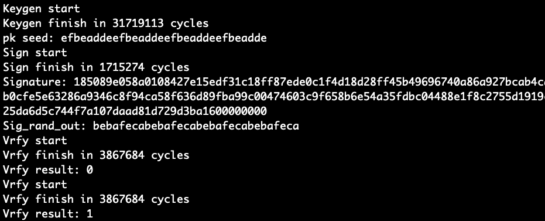

# OV hardware manual

## Hardware environment

- We build the ov hardware on 
	
	

	- Zedboard Zynq-7000 Development Board, XC7Z020 (for `SL1-p` and `SL1-s`)
		- Here we use SD card to boot into an arm-based linux to setup the flow for testing the ov hardware.
		- Therefore, we require a SD card and ethernet access.
		- Before using the ethernet access, we actually need to use UART and PROG to set up the hardware.
		- For the switches, set to **01100** for SD card boot.
	- Nexys Video Artix-7 FPGA, XC7A200T (for `SL3` and `SL5`)
		- Here we use JTAG boot, since we are using MicroBlaze softcore and SD boot requires bunch of peripheral circuits to boot into linux, which occupies some area (especially BRAM) and affects our design. Besides, SL3 and SL5 uses many BRAMs to store key, so we definitely want circuits outside our design to be fewer.
		- We use DDR3 and BRAM as local memory to run a bare metal ov test. UART and PROG should be connected
		- Set the jumper to **JTAG mode**
	- A host computer, with Ubuntu 18.04.2 and Xilinx tools v2022.1
		
		
	
		- All the ports from FPGAs are connected to USB port on the host.


## Software prerequisites

### Setup Vivado and PetaLinux (for onboard test)

#### Installation steps

- Install dependencies

	```
	sudo apt-get -y install iproute2 \
	gcc \
	g++ \
	net-tools \
	libncurses5-dev \
	zlib1g:i386 \
	libssl-dev \
	flex \
	bison \
	libselinux1 \
	xterm \
	autoconf \
	libtool \
	texinfo \
	zlib1g-dev \
	gcc-multilib \
	build-essential \
	screen \
	pax \
	gawk \
	python3 \
	python3-pexpect \
	python3-pip \
	python3-git \
	python3-jinja2 \
	xz-utils \
	debianutils \
	iputils-ping \
	libegl1-mesa \
	libsdl1.2-dev \
	pylint3 \
	cpio
	```

- Download Vitis and PetaLinux from [here](https://www.xilinx.com/support/download.html)
	- Require a Xilinx account
- Choose 2022.1, which we built upon
- Download unified installer

	

- Run the installer to install Vitis and PetaLinux

	

- For petalinux, go to the download path to find `petalinux-v2022.1-final-installer.run`, and run the final installer

	```
	mkdir -p ~/petalinux/2022.1
	./petalinux-v2022.1-final-installer.run -d ~/petalinux/2022.1
	```

- For Vivado, add board files to `data/boards/board_files`

	```
	mkdir /opt/Xilinx/Vivado/2022.1/data/boards/board_files/
	git clone https://github.com/Digilent/vivado-boards.git
	sudo cp -r vivado-boards/new/board_files/nexys_video /opt/Xilinx/Vivado/2022.1/data/boards/board_files/
	git clone https://github.com/Avnet/bdf.git
	sudo cp -r bdf/zedboard/ /opt/Xilinx/Vivado/2022.1/data/boards/board_files/
	```

- Add all the binaries to PATH. In `~/.bashrc`, append:

	```
	source /opt/Xilinx/Vivado/2022.1/settings64.sh
	source ~/petalinux/2022.1/settings.sh
	```

- Finally, we also need to install cable drivers to access FPGAs from the host
	
	```
	cd /opt/Xilinx/Vivado/2022.1/data/xicom/cable_drivers/lin64/install_script/install_drivers/
	sudo ./install_drivers
	```

#### Check the installation

```
which vivado
which petalinux-create
which vitis
which xsct
```

### Python3.10 (for python simulation and code generation)

#### Installation steps

- **Python3.10**
	- Use [miniconda](https://docs.conda.io/en/latest/miniconda.html) to create virtual environment

		```
		wget https://repo.anaconda.com/miniconda/Miniconda3-latest-Linux-x86_64.sh  // Download miniconda
		bash Miniconda3-latest-Linux-x86_64.sh                                      // Install miniconda (Reopen terminal after installation)
		conda create --name myenv python=3.10                                       // Create python3.10 environment
		conda activate myenv                                                        // Switch to "myenv" virtual environment
		pip install numba pycryptodome pyfinite libconf                             // Install packages in "myenv"
		```

#### Check the installation

```
python --version // should be python 3.10
pip list         // check the existence of numba pycryptodome pyfinite
```

### RTL simulation tool (for RTL simulation)

- At least one of the following simulation tools

	```
	which ncverilog
	which vcs
	whcih iverilog
	```

## Hardware code generation, simulation and synthesis

- Clone the project
	
	```
	git clone https://github.com/strongshih/uov_rtl.git
	cd uov_rtl/
	```

- Here are the scripts to perform codegen, simulation and synthesis

	```
	python gen_processor.py test_files/inversion-14round-aes/SL1-p/classic.json  // configure all the files and generate rtl codes for this setting
	./run_simulation                                                             // run simulation, require either ncverilog, vcs or iverilog. (can skip this step and perform sythesis)
	./run_synthesis                                                              // vivado synthesis, test_files_inversion-14round-aes_SL1-p_classic_json folder will be created in the same path
	```

- After running `./run_synthesis`, it creates a directory called `test_files_<experiment settings>` since we provide different experiment settings. Run the following to report the resource utilization and the timing result

	```
	vivado -mode tcl -source report.tcl -tclargs test_files_<experiment settings>
	```

## Zedboard test (for SL1-p and SL1-s) (finish synthesis first)

We will use SD-card boot to setup the zedboard test flow.

### SD-card partition setup

#### Prepare a SD card, format it and mount the partitions

- Partition the SD card
	- Suppose the SD card is `/dev/sdd`

	```
	sudo dd if=/dev/zero of=/dev/sdd bs=512 count=1   // clear it
	sudo fdisk /dev/sdd                               // 2 partitions
	> n
	(create first partition)
	> p
	(primary)
	> Enter
	(use default)
	> Enter 
	(use default)  
	> +512M
	(first partition size: 512M)
	> N
	(not removing the signature)
	> a
	(toggles boot flag)
	> t
	(partition 1 type)
	> c
	(W95 FAT32 (LBA))
	> n 
	(create second partition)
	> p
	(primary)
	> Enter
	(use default)
	> Enter
	(use default)
	> +4G
	(second partition size: 4G)
	> N
	(not removing the signature)
	> p
	(print out current configuration)
	Device     Boot   Start     End Sectors  Size Id Type
	/dev/sdd1  *       2048 1050623 1048576  512M  c W95 FAT32 (LBA)
	/dev/sdd2       1050624 9439231 8388608    4G 83 Linux
	> w
	(wite out)
	
	sudo mkfs.vfat /dev/sdd1                          // format (for boot)
	sudo mkfs.ext4 /dev/sdd2                          // format (for ubuntu)
	```

- Mount the partiitons

	```
	sudo mkdir /mnt/BOOT
	sudo mkdir /mnt/ROOTFS
	sudo mount /dev/sdd1 /mnt/BOOT                    // mount
	sudo mount /dev/sdd2 /mnt/ROOTFS                  // mount 
	```

#### Configure the rootfs partition

- We will install ubuntu 20.04 distribution on rootfs partition. It has arm-based ubuntu binaries.
- The built images are from [https://rcn-ee.com/rootfs/eewiki/minfs/](https://rcn-ee.com/rootfs/eewiki/minfs/), and [this](https://rcn-ee.com/rootfs/eewiki/minfs/ubuntu-20.04.4-minimal-armhf-2022-10-06.tar.xz) is what we need.

	```
	tar xf ~/Downloads/ubuntu-20.04.4-minimal-armhf-2022-10-06.tar.xz
	cd ubuntu-20.04.4-minimal-armhf-2022-10-06
	sudo tar xfvp armhf-rootfs-ubuntu-focal.tar -C /dev/sdd2 /mnt/ROOTFS  // assume rootfs partition is mounted
	sync
	sudo umount /dev/sdd2
	```

#### Configure the boot partition

- One should run `./run_synthesis` first. It will generate `{BOOT.BIN,boot.scr,image.ub}` in `test_files_<experiment settings>/zedboard_template/images/linux`
	- It synthesizes the hardware first and run `./bootpartgen` using petalinux to package linux with hardware
	- `./bootpartgen` references the `zedboard_template` as the configuration to setup boot images. 
	- The `zedboard_template` enables built-in UIO in linux-kernel (`project-spec/meta-user/recipes-kernel/linux/linux-xlnx/bsp.cfg`), mounts rootfs on second partition (`project-spec/configs/config`), and adds uio-fpga settings to device tree (`project-spec/meta-user/recipes-bsp/device-tree/files/system-user.dtsi`). 
		- (The template can be generated through the series of petalinux commands)
			
			```
			petalinux-create --type project --name test --template zynq
			cd test
			petalinux-config --get-hw-description=[folder with .xsa]  --> Image Packing Configuration --> rootfs type --> ext4
			petalinux-config -c kernel // Device Drivers --> Userspace I/O drivers --> <M> to <*> --> save then exit 
			
			// Modify test/project-spec/meta-user/recipes-bsp/device-tree/files/system-user.dtsi
			/include/ "system-conf.dtsi"
			/ {
				chosen {
					bootargs = "earlycon console=ttyPS0,115200 earlyprintk uio_pdrv_genirq.of_id=generic-uio root=/dev/mmcblk0p2 rw rootwait";
					stdout-path = "serial0:115200n8";
				};
			};

			&uovipcore_0{
    			compatible = "generic-uio";
			};
			
			petalinux-build
			cd images/linux
			petalinux-package --boot --fsbl zynq_fsbl.elf --fpga system.bit --u-boot --force // generate BOOT.BIN
			```
			
- Run the following command to build boot images.

	```
	cd test_files_<experiment settings>
	sudo cp zedboard_template/images/linux/{image.ub,boot.scr,BOOT.BIN} /mnt/BOOT   // One should mount first partition first
	sync 
	sudo umount /dev/sdd1
	```
	


### Insert SD card and boot

- After setting up SD card, we insert it and set the jumpers to `01100`, like the following. Also, connect the UART port to the computer, then switch it on.

	

- `sudo screen /dev/ttyACM0 -s 115200` to connect to the FPGA board
- Reset u-Boot environment variables

	```
	Zynq> env default -a
	Zynq> env save
	Zynq> reset
	```

- We are now in ubuntu, (default username:password is [ubuntu:temppwd]):

	```
	Ubuntu 20.04 LTS arm ttyPS0
	
	default username:password is [ubuntu:temppwd]
	
	arm login: ubuntu
	Password:
	Last login: Thu Oct  6 20:18:05 UTC 2022 on ttyPS0
	To run a command as administrator (user "root"), use "sudo <command>".
	See "man sudo_root" for details.
	
	ubuntu@arm:~$ uname -a
	Linux arm 5.15.19-xilinx-v2022.1 #1 SMP PREEMPT Mon Apr 11 17:52:14 UTC 2022 armv7l armv7l armv7l GNU/Linux
	```

### Setup the Internet access

- We can connect to the board through internet instead of using UART
- One can have internet port connecting to the router and get IP address through DHCP
- In our setting, we connect the RJ45 to our computer using a RJ45-to-USB adapter like this:

	

- On the fpga, `sudo vim /etc/netplan/01-netcfg.yaml` and `sudo netplan apply`

	```
	network:
	  version: 2
	  renderer: networkd
	  ethernets:
	    eth0:
	      dhcp4: no
	      addresses:
	        - 10.42.0.87/24
	      gateway4: 10.42.0.1
	      nameservers:
	          addresses: [8.8.8.8, 1.1.1.1]
	```

- On the host computer, set the usb interface like the following: (can also use `netplan`)

	

- Now, we need to forward fpga subnet to WAN. Here's the our current network setting as an example:

	

- On the host computer (Need to run these commands every time we reboot the host):

	```
	sudo iptables -t nat -A POSTROUTING -o enp0s31f6 -j MASQUERADE
	sudo iptables -A FORWARD -i enp0s31f6 -o enxf428531f95d0 -m conntrack --ctstate RELATED,ESTABLISHED -j ACCEPT
	sudo iptables -A FORWARD -o enp0s31f6 -i enxf428531f95d0 -j ACCEPT
	```
	
- Now, we can ssh into fpga and download some packages:

	```
	ssh ubuntu@10.42.0.87
	ping 8.8.8.8
	sudo apt update
	sudo apt install gcc git clang
	git clone git@bitbucket.org:mschen/pquov.git
	``` 
	
- After setting up the network, every time our hardware design changes, we can mount the first partition, `scp` the boot images onto it and reboot the fpga. In this way, we can have simpler development flow without using UART port.
	- Example:
		- On the host, 
			
			```
			Modify hardware (verilog files) ...
			./run_synthesis
			cd test_files_<experiment settings>
			scp zedboard_template/images/linux/{image.ub,boot.scr,BOOT.BIN} ubuntu@10.42.0.87:~
			```
		
		- On the fpga, 

			```
			sudo mount /dev/mmcblk0p1 /mnt/
			sudo cp ~/{image.ub,boot.scr,BOOT.BIN} /mnt
			sync
			sudo umount /mnt
			sudo reboot
			```
		
		
### On-board OV tests

- On the FPGA, setup environment for tests
	
	```
	sudo apt install gcc clang git
	git clone git@bitbucket.org:mschen/pquov.git  // compare with cpu
	```

- On the host, copy the ssh key so that later on the script can be executed easily

	```
	ssh-copy-id -i ~/.ssh/id_rsa.pub ubuntu@10.42.0.87
	```

- On the host, test the design (assuming `./run_synthesis` is already run):
	- Set the `hostip` variable in the file `run_zed_test` first, and
	
		```
		./run_zed_test test_files_<experiment settings>
		```
	
	- This script copies the c codes (related to experiment settings) and `test.data` to the fpga, compiles them, and runs them with `pquov` remotely.
	- The script assumes the hardware environment matches the codes to be run. 
	- Sample out, the upper part is FPGA run while the lower part is CPU run:
	
		

		- The scripts compares the signing result and the verifying result using the same digest, salt, pk_seed and sk_seed.
		
## Nexys Video test (for SL3 and SL5) (finish synthesis first)

We will use JTAG boot to setup the nexys video test flow.

- One should run `./run_synthesis` and continue this step
	- It synthesizes the hardware and runs `./build_nexys_project`
	- `./build_nexys_project` uses `xsct` to build application (test code) and the generates bitstream
- Run `./run_nexys_test test_files_<experiment settings>`
	- It will connect to the board and download the bitstream
- `sudo screen /dev/ttyUSB0 -s 9600` to see the result. Sample out:

	
	
	


## Others

### Python simulator

- We also provide python simulator to perform behavioral simulation.

	```
	python simulator/codegen.py -n 16 -v 68 -o 44 -g 8 -m classic -r 10  -e        // Generate test.data and simulate
	python simulator/codegen.py -h                                                 // See the meaning of parameters
	```

### The configuration file

- Sepcify the variables in this file
- Example:

	```
	N = 16;
	V = 68;
	O = 44;
	GF_bit = 8;
	row_layout = [8, 8];
	col_layout = [4, 4, 4, 4];
	right_delay_every_X_resource_unit = 1;
	mode = "classic";
	aes_round = 10;
	use_inversion = false;
	use_tower_field = false;
	use_pipelined_aes = false;
	platform = "zedboard";
	```

## Reference

- [UG1144: PetaLinux Tools Documentation](https://docs.xilinx.com/r/2021.2-English/ug1144-petalinux-tools-reference-guide/Overview)
- [Xilinx Embedded-Design-Tutorials](https://xilinx.github.io/Embedded-Design-Tutorials/docs/2022.1/build/html/docs/Introduction/Zynq7000-EDT/7-linux-booting-debug.html)
- [Xilinx-wiki.atlassian.net](https://xilinx-wiki.atlassian.net/wiki/spaces/A/pages/18842250/PetaLinux)
- [Spacewire](https://www.spacewire.co.uk/tutorial/petalinux_build/)
- [Nexys video](https://digilent.com/reference/programmable-logic/nexys-video/reference-manual)
- [Zedboard](https://digilent.com/reference/programmable-logic/zedboard/reference-manual)
- [Vivado and Vitis for Baremetal Software Projects](https://digilent.com/reference/programmable-logic/guides/getting-started-with-ipi)
- [SPI Flash](https://digilent.com/reference/learn/programmable-logic/tutorials/htsspisf/start)
- [UG1400: vitis-embedded](https://docs.xilinx.com/r/en-US/ug1400-vitis-embedded/Getting-Started-with-Vitis)
	
